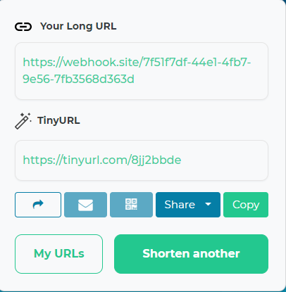
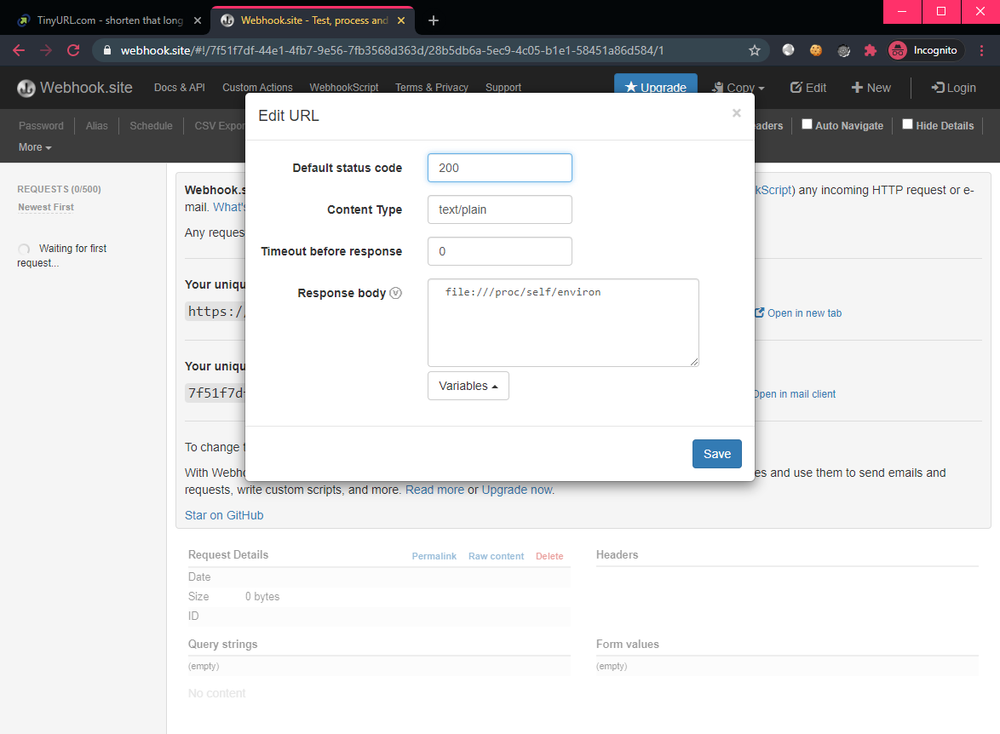
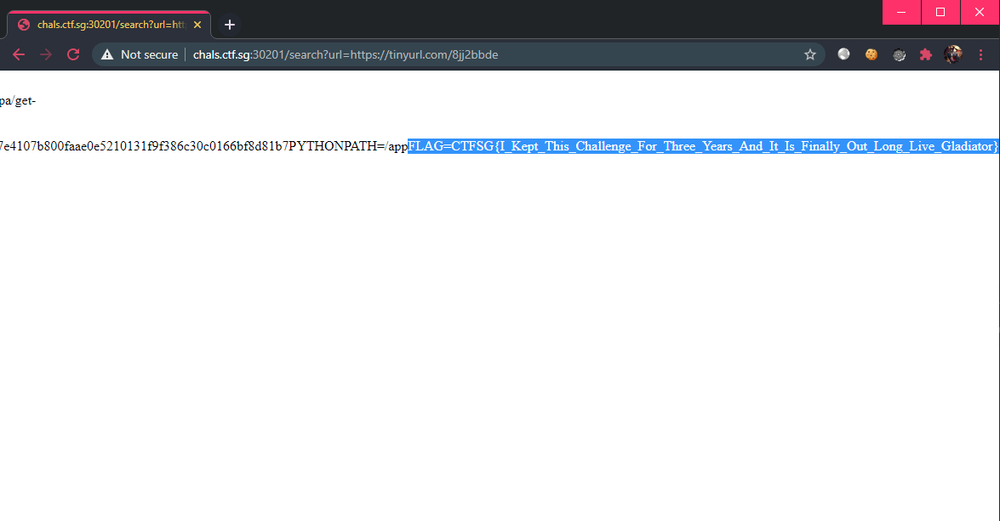

# [Web] Tangerine Stan

## Description

I developed a super secure url parser. No way you can bypass it. But if you do, your bounty is in the Environment Variable!

Psst: It only accept links from tinyurl.com...

## Walkthrough

We are given the [source code](files/tangerinestan-server.py) which is quite short:

```py
def hello():
    if flaskrequest.args['url'] == None:
        return "You need to access via /search?url=Your URL"
    url_proxy = flaskrequest.args['url']
    b = urlparse(url_proxy)
    if b.netloc != "tinyurl.com":
        return "URL is not from tinyurl.com"
    proxy_data = request.urlopen(url_proxy)
    safe_url = proxy_data.read().decode('utf-8')
    safe_url_parsed = urlparse(safe_url)
    if safe_url_parsed.scheme in ["file","gopher","ftp","smtp","tftp","mailto"]:
        return "Illegal Scheme Detected!"
    response = request.urlopen(safe_url)
    return response.read().decode('utf-8')
```

The source also mentioned that the flag is stored on the server's the environment.

The code first takes a URL string supplied as a HTTP parameter `url`, and parses it. Then it checks if the `url` domain is `tinyurl.com`.

Then, the code follows the tinyurl original URL and reads its content. This content is then parsed as a URL again. However, the URL scheme cannot contain `"file","gopher","ftp","smtp","tftp","mailto"`. Once again, the parsed URL is followed with `urlopen()`.

It appears we have to have a proxy again which will serve 1 URL as its content. Time to use webhook.site once again. We will use tinyurl to point to our webhook.site proxy:




Our webhook.site will contain our payload which will read the server's environment. We can do so by reading ` file:///proc/self/environ` (notice the pre-pended space, which will bypass the checks): 



Then, visiting `http://chals.ctf.sg:30201/search?url=https://tinyurl.com/8jj2bbde` will trigger the payload, giving us the flag:



Flag: `CTFSG{I_Kept_This_Challenge_For_Three_Years_And_It_Is_Finally_Out_Long_Live_Gladiator}`
